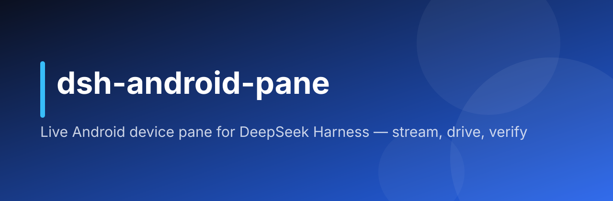

# dsh-android-pane



在 DeepSeek Harness（DSH）对话旁打开一块 **Android 实时画面面板**：模拟器和 USB 真机通吃，agent 能点按操作并用截图 + 控件树自证改动，你也能随时上手共操作。

[English](README.en.md) · [Releases](https://github.com/hoyyang/dsh-android-pane/releases) · [更新日志](CHANGELOG.md)

<p align="center">
  <a href="LICENSE"></a>
  
  
</p>

## 安装

```sh
dsh plugin add github:hoyyang/dsh-android-pane
```

零配置：不需要 API Key、不需要改 DSH 配置。需要 `adb` 在 PATH（Android SDK），一台开了 USB 调试的设备或任一模拟器；macOS/Linux + DSH web profile。

## 有啥用

- **实时画面**：scrcpy-server H.264 直推 DSH 网页端，WebCodecs 硬解（本机回环 30–60fps）；scrcpy 起不来（老设备/强化安全系统）自动降级截图轮播。
- **agent 自己会验证**：10 个上下文经济工具——点按/滑动/文本/按键/滚动/旋转（每次操作自动回截图）、uiautomator 控件树带点按坐标、mp4 录屏、host 托管调试会话（录屏 + logcat + 动作时间线）。
- **FLAG_SECURE 黑屏自愈**：银行/密码类应用自动识别，横幅提示 + 缓解链（`adb root` → root 框架启用指引 → SECURE 位复查终局判定），仍被系统拦截时降级为可点按的控件树文本视图，每步结果明示，绝不静默。
- **人机共屏**：面板里点=点按、拖=滑动；agent 操作时亮红色徽标（面板手势暂被拒绝），谁在开车一目了然。
- **会话隔离**：一台设备同时只归一个会话；闲置 10 分钟自动释放（模拟器关机、真机仅断开）。
- **仅本机**：所有流只允许 127.0.0.1 访问（其余一律 403），面板变更做同源校验。

## 30 秒上手

1. 手机开 USB 调试连电脑（或启动任一模拟器）；
2. 对 agent 说「连接我的安卓设备」；
3. DSH 网页端出现设备实时画面；
4. 说「点一下设置图标」——围观 agent 操作，每步自动回截图；
5. 你也可以直接在画面上点按、拖动，人机共屏。

## 进阶用法

- **中文输入**：`android_pane_install_ime`（一次性装 ADBKeyboard 输入法，中文经剪贴板粘贴）。
- **元素级操作**：`android_pane_ui` 按 find/click/setText，文本模糊匹配控件，替代盲点坐标。
- **安全页面检测开关**：config `flagSecureCheck`（默认 true）。
- **MIUI/HyperOS**：注入点击需打开「USB 调试（安全设置）」，否则面板自动降为只看。

## 工作原理

attach 时把 scrcpy-server 推上设备、以 app_process 跑 H.264 编码，视频流经 adb 端口转发到本机回环，网页端 WebCodecs 硬解渲染；注入指令经 adb 下发，控件树来自 uiautomator dump。debug 模式由 host 托管：分段 mp4 录屏 + 全量 logcat + 结构化动作时间线，供事后逐动作回放分析。

## 可靠性与验收

按 dsh-plugin-build 生产线交付：隔离 staging 验证、卸载重装幂等、冷启动三故障静态检测、十门审查；模拟器与多品牌真机实测（H.264 串流、注入、中文输入、FLAG_SECURE 降级链、多设备并发）。

## 常见问题

- **画面全黑？** 多为 FLAG_SECURE 页面（银行/密码管理器），面板会出横幅并给缓解链；普通页面黑屏先确认 `adb devices` 在线。
- **点按没反应？** MIUI/HyperOS 需开「USB 调试（安全设置）」。
- **帧率低？** 多设备同时串流会分带宽，先 detach 不用的设备。

## 本地构建

```sh
git clone https://github.com/hoyyang/dsh-android-pane && cd dsh-android-pane
npm install && npm run build && npm run build:client
```

## 卸载

```sh
dsh plugin remove dsh-android-pane
```

卸载即停流、回收 adb 子进程；状态在 `<DSH_HOME>/dsh-android-pane/`（截图、state.json），可整目录删除。

## 隐私

agent 对设备的截屏会发送给所配置的模型。勿在受控设备上登录真实账号。

## 许可证

MIT — 见 [LICENSE](./LICENSE)。随包分发的 `scrcpy-server`（Apache-2.0）与 `ADBKeyboard.apk`（Apache-2.0）见 [THIRD_PARTY_NOTICES.md](./THIRD_PARTY_NOTICES.md)。
